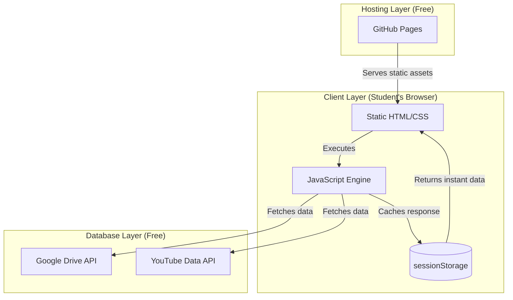
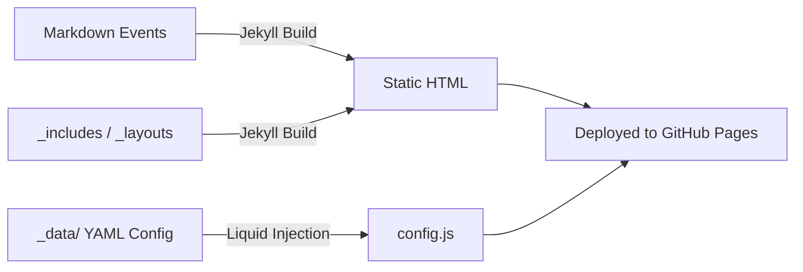
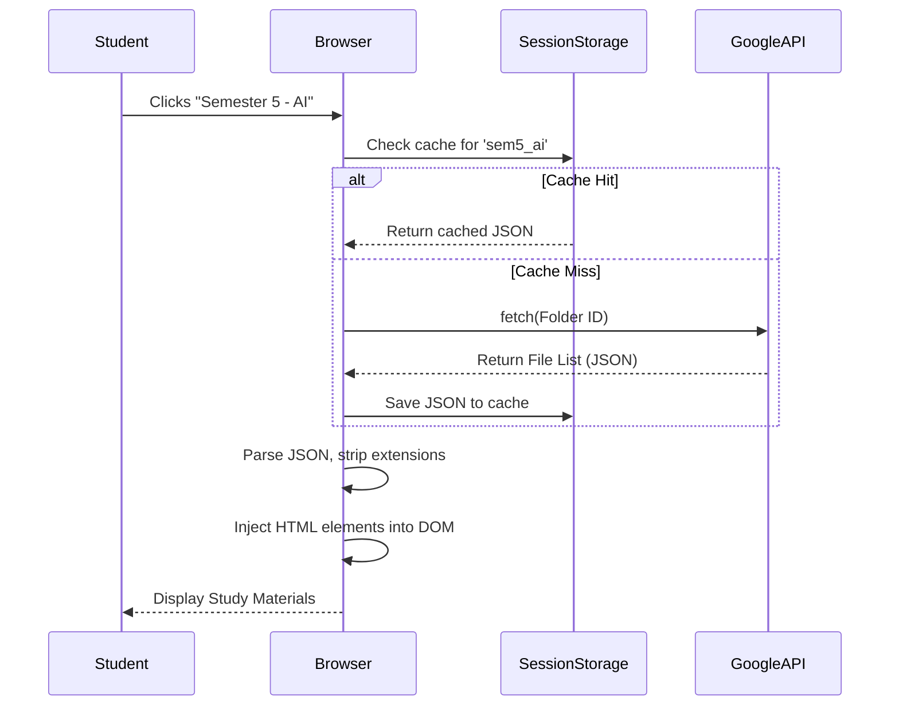

# System Architecture Deep Dive

## Overview

The ITGPG website operates on a **Thick-Client Serverless Architecture**. It functions as a static Jekyll site hosted on GitHub Pages, but acts as a dynamic application in the browser.

To maintain a **$0 infrastructure budget**, all data fetching (study materials, certificates, newsletters, gallery images) is offloaded to the user's browser, pulling directly from Google Drive and YouTube APIs.

---

## 1. Core Architecture



---

## 2. Build Pipeline

The project uses Jekyll to compile Markdown and Liquid templates into static HTML.



1. **Jekyll Execution**: Merges `_layouts/default.html` with individual pages.
2. **Configuration Compilation**: `_data/site_config.yml` is parsed and serialized into a raw JavaScript object in `assets/js/config.js` via Liquid (`{{ site.data.site_config | jsonify }}`).
3. **Deployment**: Pushed to the `gh-pages` branch or served directly via GitHub Actions.

---

## 3. Runtime & Request Lifecycle

When a student visits a dynamic page (e.g., Study Materials):



---

## 4. Configuration System

To isolate content managers from JavaScript logic, a strict "Zero-JS" pattern is enforced.

All IDs (Drive folders, YouTube playlists, API keys) live in `_data/site_config.yml`.

```yaml
# _data/site_config.yml
API_KEY: "AIzaSy..."
FOLDER_IDS:
  certificates: "1vXU0c..."
```

This is automatically injected into the global `window.CONFIG` object at build time, allowing the JS to access it dynamically without hardcoded values.

---

## 5. JavaScript Architecture

The JS layer is highly componentized:
- **`config.js`**: Holds the global `CONFIG` object.
- **`YouTubeHandler.js`**: Standardized fetch wrapper for YouTube Data API v3 and Google Drive v3 API.
- **Page Controllers** (`events.js`, `certificate-verification.js`): Page-specific logic that maps API responses to the DOM.

### Caching Strategy
To prevent Google API quota exhaustion (e.g., 50 students clicking folders simultaneously), aggressive caching is implemented via `sessionStorage`. Data is cached for the lifecycle of the browser tab.

---

## 6. CSS Architecture

We use **Vanilla CSS** with **Bootstrap 5.3** handling the grid system and basic utility classes.

Styles are heavily scoped to prevent bleed:
- `main.css`: Global variables (colors, fonts).
- `components/`: Navbar, footer, hero section.
- `pages/`: Specific page styles (e.g., `certificate-verification.css` holds the confetti animation logic).

---

## 7. Limitations & Technical Debt

### Limitations
- **API Quotas**: Relying entirely on client-side fetching means that if usage spikes massively, the Google API daily quota could be exceeded, temporarily breaking dynamic pages.
- **SEO for Dynamic Content**: Because study materials are loaded via JS, search engine crawlers will not index the individual PDF links. (We mitigate this by heavily indexing the static pages).

### Known Technical Debt
- **No Global Error Boundaries**: If `window.CONFIG` fails to load, subsequent JS files will throw undefined errors.

---

## 8. Future Improvements

1. **Proxy Server (Cloudflare Workers)**: If API quotas become an issue, we can route Google API requests through a free Cloudflare Worker to cache requests globally, reducing hits to Google.
2. **Strict Typings**: Converting the JS components to TypeScript (or adding JSDoc comments) to prevent runtime errors when `site_config.yml` shapes change.
3. **Automated E2E Testing**: Implementing Cypress or Playwright to simulate navigating folders to catch silent API failures before users notice them.
